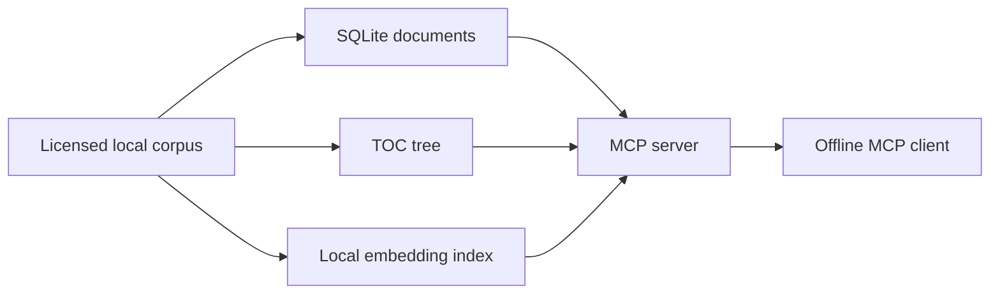

<!-- BRAND_REFRESH_2026_08_25 -->
<div align="center">

# ⚓ imo-rules-mcp

### Bring your corpus. Keep the rules local.

**A read-only MCP server for offline semantic search, keyword search, document retrieval, citation traversal, and structured browsing across a locally supplied IMO regulatory corpus.**


[Tools](#mcp-tools) · [Set up a corpus](#quickstart) · [Rights boundary](#corpus-and-rights-boundary) · [Full technical reference](README.technical.2026-08-25.md)

</div>

---

> **The server is open. The corpus is yours to license, store, and protect.**

`imo-rules-mcp` exposes a local corpus of maritime instruments to MCP-compatible clients without crawling the web or redistributing regulation text.

## MCP tools

| Tool | Purpose |
|---|---|
| `imo_semantic_search` | Meaning-based retrieval with ranked regulations, breadcrumbs, snippets, and document keys. |
| `imo_keyword_search` | Literal title or body search. |
| `imo_get_document` | Retrieve one normalized regulation with navigation context and citations. |
| `imo_list_instruments` / `imo_browse` | Navigate instruments, chapters, and regulations. |
| `imo_get_citations` | Follow outbound cross-references. |
| `imo_stats` | Inspect corpus coverage and index state. |

## Architecture



## Quickstart

Install:

```bash
npm install
```

Import a compatible exported corpus:

```bash
node scripts/import-corpus.mjs /path/to/KRcrawl
```

Start the stdio server:

```bash
npm start
```

A repository-scoped `.mcp.json` is included for hosts that support project-local MCP configuration.

## Corpus and rights boundary

This repository contains **server code only**. It does not ship SOLAS, MARPOL, STCW, IMO Codes, or any other regulation corpus.

- Supply only material you are licensed to use.
- Keep `corpus/` outside version control.
- Do not publish or redistribute proprietary regulation text.
- If a convenience bundle includes corpus data, keep that repository private and apply the applicable rights controls.
- Server-code licensing does not grant rights to the corpus.

## Runtime contract

- Read-only tools only.
- No crawler and no required network path.
- Semantic search loads its local model/index on demand.
- Other tools operate directly on the local corpus structures.
- Corpus completeness, currency, interpretation, and legal authority remain external responsibilities.

## Full technical reference

The original detailed README — including the expected corpus layout, environment variables, client configuration, and tool-by-tool behavior — is preserved unchanged at:

**[README.technical.2026-08-25.md](README.technical.2026-08-25.md)**

## License

Server code is MIT. Corpus data is excluded from that grant.
